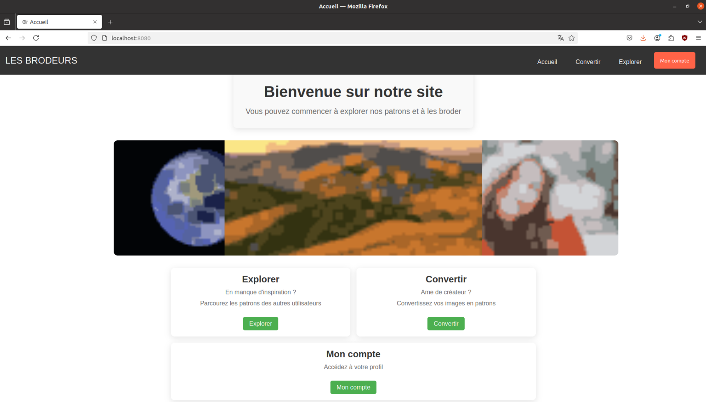
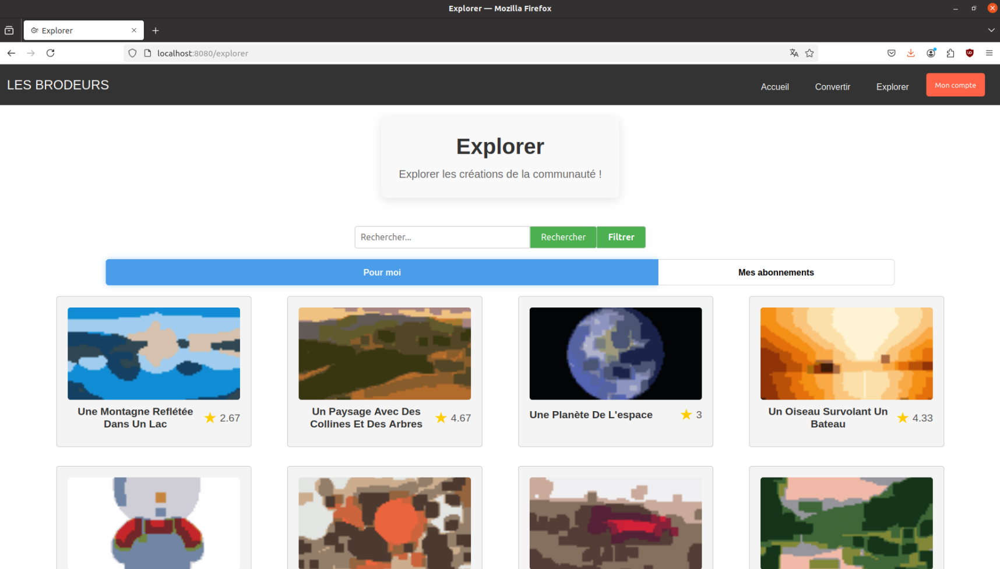
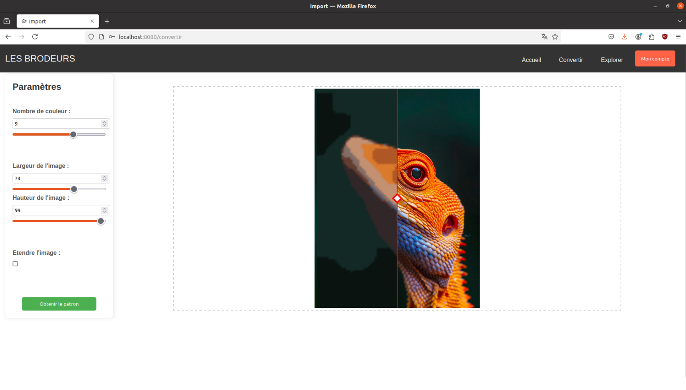
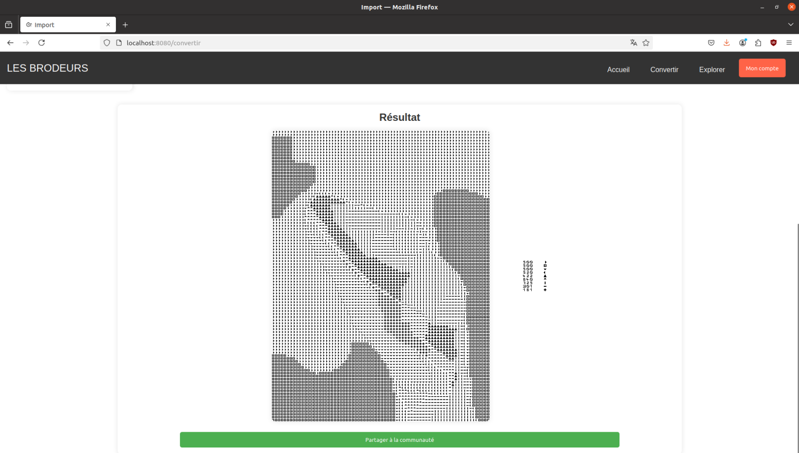

# Les Brodeurs

> Cross-stitch pattern sharing platform - Université de Bourgogne.

## Description

**Les Brodeurs** is a community web application where users can share, discover, and rate cross-stitch embroidery patterns. It features an **image-to-pattern conversion** tool powered by Azure Computer Vision, a **recommendation system** based on user behaviour and tag preferences, and full social features (follows, ratings, profiles).

## Features

- Image-to-pattern conversion via Azure Computer Vision
- Pattern browsing with personalised recommendations
- User authentication (JWT)
- User profiles, follows, and ratings
- Privacy control per pattern (public / private)
- ZIP download of pattern files

## Tech stack

| Technology | Usage |
|---|---|
| React + Vite | Frontend |
| Express.js | Backend API |
| PostgreSQL | Database |
| JWT | Authentication |
| Azure Computer Vision | Image processing |
| Python | Recommendation engine |

```
JavaScript  61.3%
Python      25.4%
CSS          8.1%
HTML         5.2%
```

## Screenshots

| | |
|---|---|
|  |  |
|  |  |

## Requirements

- Node.js 18+
- PostgreSQL 14+
- Azure Computer Vision key *(optional - only required for the Import page)*

## Getting started

```bash
# 1. Clone the repository
git clone <repo-url>
cd broderie-main

# 2. Create the database
psql -U postgres -c "CREATE DATABASE les_brodeurs;"
psql -U postgres -d les_brodeurs -f database/init.sql

# 3. Configure the backend
cd backend
cp config.example.json config.json
# Edit config.json if your PostgreSQL credentials differ from postgres/postgres

cp .env.example .env
# Edit .env to set your JWT_SECRET and Azure keys (optional)

# 4. Install dependencies
cd backend && npm install
cd ../frontend && npm install

# 5. Start the application
# Terminal 1 - backend (port 8080)
cd backend && node index.js

# Terminal 2 - frontend (port 5173)
cd frontend && npm run dev
```

Open [http://localhost:5173](http://localhost:5173)

> Test accounts: `alice@example.com` / `bob@example.com` - password: `password123`

## Author

**Sid Ali** - Université de Bourgogne, M2
